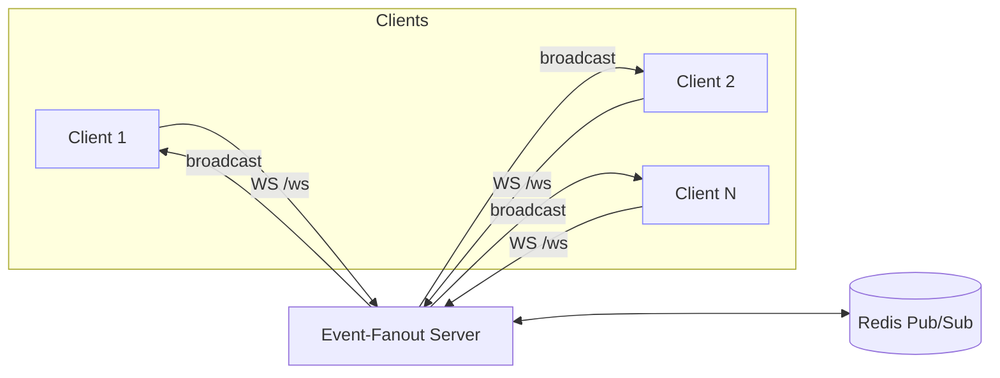

# event-fanout — WebSocket Fan-out Service (Go + Redis Pub/Sub)

[](https://go.dev/)
[](https://github.com/TheRealSaiTama/event-fanout/actions)
[](#docker-compose)

High-throughput **room-based broadcast** over WebSockets with **heartbeats** and **back-pressure-aware writers**. Horizontal fan-out via **Redis Pub/Sub**. Clean shutdown & connection drain.

## Features
- Goroutine/channel design with `Hub` → `Room` → `Client` primitives
- Back-pressure handling (bounded outbox + drop & accounting)
- `/ws` endpoint with `room` & `client_id` params
- Health & simple metrics endpoints
- Dockerfile, Compose, GitHub Actions CI
- k6 script + Go bench harness for repeatable load tests

## Quickstart

```bash
# 1) Redis
docker run -d --name ef-redis -p 6379:6379 redis:7-alpine

# 2) Run server locally
make run   # or: ADDR=:8081 REDIS_ADDR=localhost:6379 go run ./cmd/server

# WS URL: ws://localhost:8081/ws?room=room1&client_id=alice
````

## HTTP

* `GET /healthz` → `"ok"` if Redis reachable
* `GET /metrics` → `rooms`, `clients`, `dropped_messages`
* `GET /ws?room=<name>&client_id=<id>` → WebSocket endpoint

## Bench Results (2025-11-06)

* **Clients (K)**: **200**
* **Throughput**: **3,992 msgs/s**
* **P95 latency**: **0.9 ms**
* p50: 0.6 ms, p99: 1.5 ms

> Method: custom Go WS bench (`bench/latency_bench.go`) over a single Redis-backed fan-out room on localhost.

## Architecture (Mermaid)



## Repo Layout

```
.
├─ cmd/server/main.go
├─ internal/
│  ├─ server/    # HTTP server, routing, metrics
│  ├─ store/     # Redis wrapper + Pub/Sub (Broadcaster interface)
│  └─ ws/        # Hub / Room / Client, WS handler, back-pressure
├─ bench/
│  ├─ latency_bench.go    # Go bench harness
│  └─ ws_broadcast.js     # k6 WS script
├─ Makefile  Dockerfile  docker-compose.yml  .github/workflows/ci.yml
```

## Dev

```bash
make build        # build bin/event-fanout
make run          # run on :8081 (needs Redis)
make bench        # k6 script (optional)
```

## Roadmap

* Multi-node hub with sharded registries
* JWT auth & per-room ACLs
* Prometheus metrics & dashboards
* NATS/JetStream swap for Pub/Sub

## License

MIT (add a LICENSE file if you want)

---

### Resume Snippet

**Built “event-fanout” (Go + Redis Pub/Sub)** with room-based broadcast, heartbeats, and back-pressure-aware writers; load-tested to **200 clients**, **3,992 msgs/s**, **P95 0.9 ms** on localhost.
